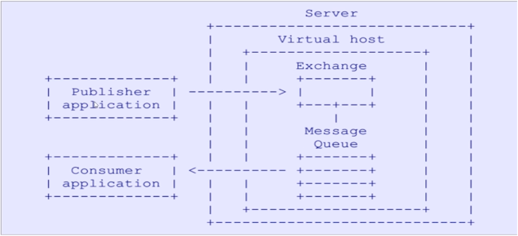

# RabbitMQ基础

* RabbitMQ是一个开源的消息代理和队列服务器，用来通过普通协议在完全不同的应用之间共享数据，RabbitMQ是使用Erlang语言编写的，并且RabbitMQ是基于AMQP协议的。
  * *RabbitMQ底层采用Erlang语言进行编写*
  * *开源、性能优秀，稳定性保障*
  * *与SpringAMQP完美的整合、API丰富*
  * *集群模式丰富，表达式配置，HA模式，镜像队列模型*
  * *保证数据不丢失的前提做到高可靠性、可用性*

* AMQP即Advanced Message Queuing Protocol（高级消息队列协议）。AMQP协议模型如下：

