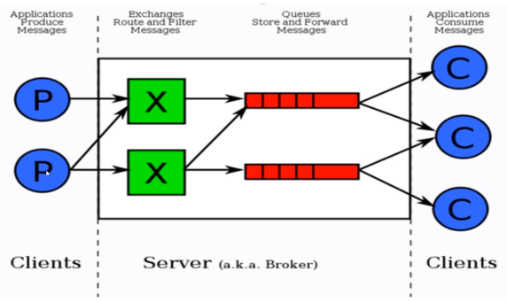

# RabbitMQ核心概念

## RabbitMQ的整体架构

## AMQP核心概念

* Server：又称为Broker，接受AMQP连接，实现AMQP实体服务
* Connection：连接，应用程序与Broker的网络连接
* Channel：网络信道，几乎所有的操作都在Channel中进行，Channel是进行消息读写的通道。客户端可以建立多个Channel，每个Channel代表一个会话任务
* Message：消息，服务器和应用程序之间传送的数据，由Properties和Body组成。Properties可以对消息进行修饰，比如消息的优先级、延迟等高级特性；Body就是消息体内容
* Virtual host：虚拟地址，用于进行逻辑隔离，最上层的消息路由。一个Virtual Host里面可以有若干个Exchange和Queue，同一个虚拟主机里不能用相同名称的Exchange和Queue
* Exchange：交换机，接收消息，根据路由键转发消息到绑定的队列
* Binding：Exchange和Queue之间的虚拟连接，binding中可以包含routing key
* Routing key：一个路由规则，虚拟机可以用它来确定如何路由一个特定消息
* Queue：也称为Message Queue，消息队列，保存消息并将它们转发给消费者